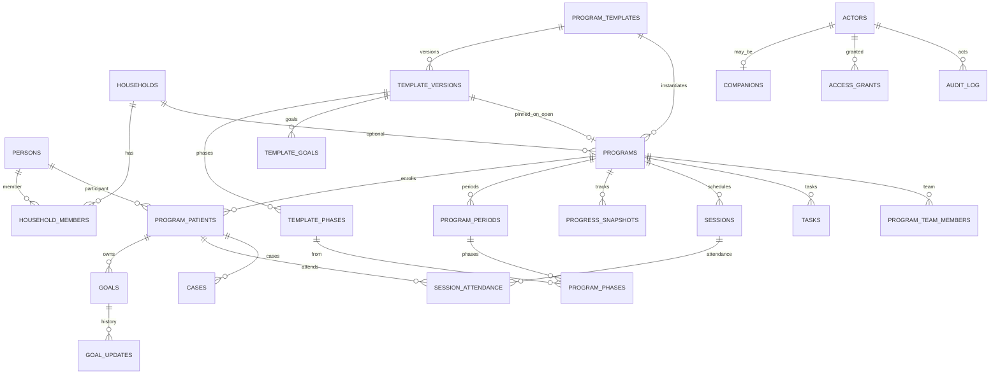

# ERD — rehab_demo

```mermaid
erDiagram
  HOUSEHOLDS ||--o{ HOUSEHOLD_MEMBERS : has
  PERSONS ||--o{ HOUSEHOLD_MEMBERS : member
  PROGRAM_TEMPLATES ||--o{ TEMPLATE_VERSIONS : versions
  TEMPLATE_VERSIONS ||--o{ TEMPLATE_PHASES : phases
  TEMPLATE_VERSIONS ||--o{ TEMPLATE_GOALS : goals
  PROGRAM_TEMPLATES ||--o{ PROGRAMS : instantiates
  TEMPLATE_VERSIONS ||--o| PROGRAMS : pinned_on_open
  HOUSEHOLDS ||--o{ PROGRAMS : optional
  PROGRAMS ||--o{ PROGRAM_PATIENTS : enrolls
  PERSONS ||--o{ PROGRAM_PATIENTS : participant
  PROGRAMS ||--o{ PROGRAM_PERIODS : periods
  PROGRAM_PERIODS ||--o{ PROGRAM_PHASES : phases
  TEMPLATE_PHASES ||--o{ PROGRAM_PHASES : from
  PROGRAM_PATIENTS ||--o{ GOALS : owns
  GOALS ||--o{ GOAL_UPDATES : history
  PROGRAMS ||--o{ PROGRESS_SNAPSHOTS : tracks
  PROGRAMS ||--o{ SESSIONS : schedules
  SESSIONS ||--o{ SESSION_ATTENDANCE : attendance
  PROGRAM_PATIENTS ||--o{ SESSION_ATTENDANCE : attends
  PROGRAMS ||--o{ TASKS : tasks
  PROGRAM_PATIENTS ||--o{ CASES : cases
  ACTORS ||--o| COMPANIONS : may_be
  PROGRAMS ||--o{ PROGRAM_TEAM_MEMBERS : team
  ACTORS ||--o{ ACCESS_GRANTS : granted
  ACTORS ||--o{ AUDIT_LOG : acts
```

**Central entity:** `PROGRAM_PATIENTS`.
